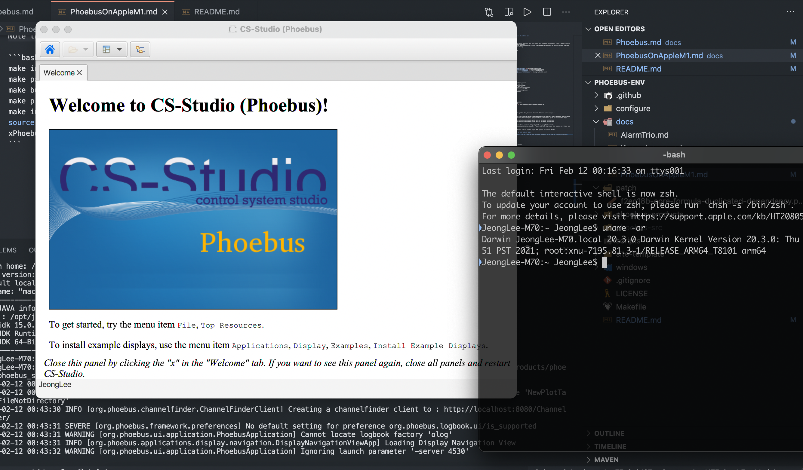

# Phoebus on Apple Silicon M1 with Big Sur

Note that one cannot run Phoebus with the Native (aarch64) support, because of javafx.

## Requirements

### JAVA environment

One should configure the Native (aarch64) or the emulated (x86_64) Java environment with the maven environment. Please check the following repository <https://github.com/jeonghanlee/java-env> for Darwin (aarch64, x86_64) and Linux. One can check them through

```bash
$ make vars FILTER=UNAME
UNAME_M = arm64
UNAME_S = Darwin
```

OR

```bash
UNAME_M = x86_64
UNAME_S = Darwin
```

## Build

* `arm64` and `x86_64`

```bash
echo "JAVA_HOME:=/opt/java-env/JDK15" > configure/RELEASE.local
echo "JAVA_PATH:=/opt/java-env/JDK15/bin" >> configure/RELEASE.local
echo "MAVEN_HOME:=/opt/java-env/MAVEN363" >> configure/RELEASE.local
echo "MAVEN_PATH:=/opt/java-env/MAVEN363/bin" >> configure/RELEASE.local
```

## Phoebus on the Apple M1 with `x86_64` mode

Note that one should install `x86_64` JAVA JDK. And the other procedure is the same as Linux distribution.

### Command-Line Environment

```bash
make init
make patch
make build.phoebus
make prop.phoebus
make install.phoebus
source scripts/activate-phoebus
xPhoebus
```

### Applications within Apple LaunchPad

Please check the LaunchPad, one can see the Adavneced Light Source Phoebus Icon.

```bash
make init
make patch
make build.phoebus
make prop.phoebus
make macapp
```

### Zipped Apple Applications

Phoebus.app.zip file will be located in `$TOP`.

```bash
make init
make patch
make build.phoebus
make prop.phoebus
make zipapp
```

||
| :---: |
|**Figure 1 Running Phoebus on Apple M1 with x86_64 mode** |

## Phoebus on the Apple M1 with `arm64` mode

```bash
$ make init
$ make build.phoebus
$ make prop.phoebus
$ make install.phoebus
$ make exist
/opt/phoebus-products/phoebus
├── .versions
├── activate-phoebus
├── authorization.conf
├── bin
├── lib
├── phoebus.jar
├── phoebus.sh
├── phoebus_logback.xml
├── phoebus_logging.properties
├── phoebus_settings.ini
└── product-phoebus.jar -> /opt/phoebus-products/phoebus/phoebus.jar

2 directories, 9 files
```

### Notice

The building procedure is quickly done, however, I see the following error messages :

```bash
Loading library prism_es2 from resource failed: java.lang.UnsatisfiedLinkError: /Users/JeongLee/.openjfx/cache/15/libprism_es2.dylib: dlopen(/Users/JeongLee/.openjfx/cache/15/libprism_es2.dylib, 1): no suitable image found.  Did find:
/Users/JeongLee/.openjfx/cache/15/libprism_es2.dylib: mach-o, but wrong architecture
/Users/JeongLee/.openjfx/cache/15/libprism_es2.dylib: mach-o, but wrong architecture
```

This may be fixed by the follwing commit in <https://github.com/openjdk/jfx/commit/e1adfa9179bb05a879b419b6221e8aa980fd6af1>. However, I don't know when they accept this commit, and release new version of jfx.
